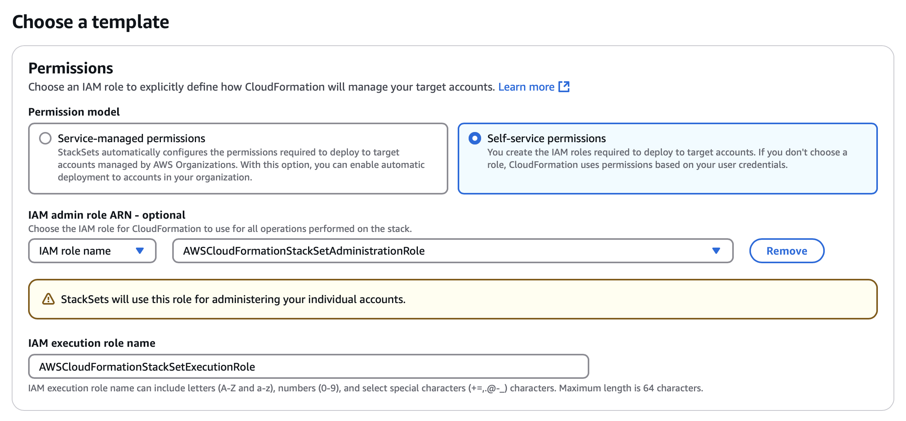
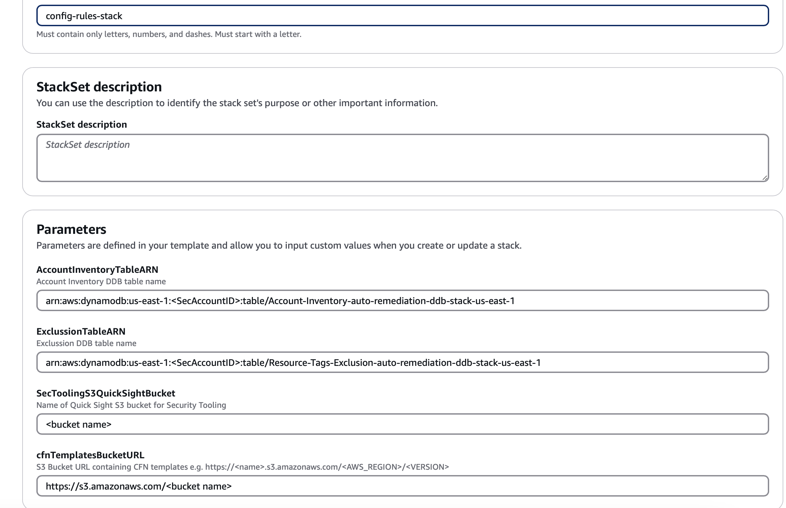
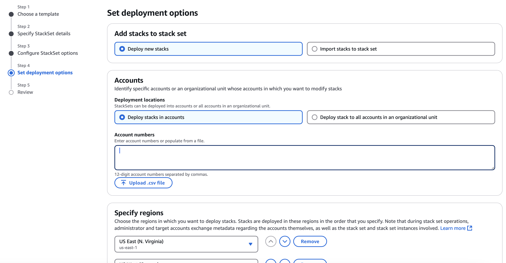

# Org AWS Config Rules

This repository provides a comprehensive solution for implementing AWS Config rules with auto-remediation across an organization. It includes CloudFormation templates, IAM roles, and Lambda functions to automate the process of evaluating and remediating non-compliant resources.

| :exclamation: Single Account Test |
|:----------------------------------|
| **To manually test a single rule in a single region, follow the AWS documentation [here](https://docs.aws.amazon.com/config/latest/developerguide/evaluate-config_manage-rules.html). This is recommended before implementing the rule at the Org Level.** |

## CloudFormation Template

To enable an AWS Config rule with auto-remediation, follow these steps:

1. **Required Roles:**
    - To deploy this solution, there are two required roles by CloudFormation to create stack sets. Use the `CFN_IAM.yaml` template and follow [these instructions](https://docs.aws.amazon.com/AWSCloudFormation/latest/UserGuide/stacksets-orgs-associate-stackset-with-org.html#stacksets-orgs-associate-stackset-with-org-console).

2. **Deploy DynamoDB Tables:**
    - Deploy the CloudFormation stack using [security_base.yaml](https://github.com/4ndr4s/config-rules-with-auto-remediation/blob/main/CFN/security_base.yaml) following [these instructions](https://docs.aws.amazon.com/AWSCloudFormation/latest/UserGuide/cfn-console-create-stack.html#create-stack). This stack will create two DynamoDB tables used by the auto-remediation solution.

3. **Deploy Self-Managed Stack Set:**
    - To deploy a self-managed stack set with current auto-remediation rules, follow [these instructions](https://docs.aws.amazon.com/AWSCloudFormation/latest/UserGuide/stacksets-getting-started-create-self-managed.html#stacksets-getting-started-create-self-managed-console) using the [base.yaml](https://github.com/4ndr4s/config-rules-with-auto-remediation/blob/main/CFN/base.yaml) template.

    

    

    

    - Replace parameters as described below:
      - `AccountInventoryTableARN`: Database ARN from Step 2
      - `ExclussionTableARN`: Database ARN from Step 2
      - `SecToolingS3QuickSightBucket`: Quicksight bucket to store auto-remediation reports
      - `cfnTemplatesBucketURL`: S3 bucket to store CFN templates.

| :exclamation: NOTE |
|:-------------------|
| **The bucket described in [base.yaml](https://github.com/4ndr4s/config-rules-with-auto-remediation/blob/main/CFN/base.yaml#L5) needs to be accessible from your organization principal.** |

## Add A New AWS Config Rule

To add a new AWS Config Rule, follow these steps:

1. **Create a New YAML File:**
    - Copy [rule.yaml.template](https://github.com/4ndr4s/config-rules-with-auto-remediation/blob/main/CFN/rule.yaml.templatehttps://github.com/4ndr4s/config-rules-with-auto-remediation/blob/main/CFN/rule.yaml.template) into a new YAML file. Use a filename that refers to the control ID.
    - For Name, provide a unique name for the rule and replace it in the new YAML file on line [ConfigRuleName](https://github.com/4ndr4s/config-rules-with-auto-remediation/blob/main/CFN/rule.yaml.template#L169).
    - For Description, add a description for the rule.
    - Each rule has different properties and input parameters. To identify these, use the S3 template link, replace THE_RULE_IDENTIFIER with the Managed rule name: `http://s3.amazonaws.com/aws-configservice-us-east-1/cloudformation-templates-for-managed-rules/THE_RULE_IDENTIFIER.template`. For example: `http://s3.amazonaws.com/aws-configservice-us-east-1/cloudformation-templates-for-managed-rules/RDS_INSTANCE_PUBLIC_ACCESS_CHECK.template`. Replace [ComplianceResourceTypes](https://github.com/4ndr4s/config-rules-with-auto-remediation/blob/main/CFN/rule.yaml.template#L175) with the required scope for the rule.
2. **Select the Appropriate Region:**
    - Ensure that the region selector is set to a region that supports AWS Config rules. For a list of supported regions, refer to the AWS Config Regions and Endpoints in the Amazon Web Services General Reference.

### Default Parameters

| :exclamation: NOTE |
|:-------------------|
| **No changes are needed for these parameters.** |

```yaml
AccountId:
  type: String
  default: !Sub ${AWS::AccountId}
AutomationAssumeRole:
  type: String
  default: !Sub 'arn:aws:iam::${AWS::AccountId}:role/${AutomationRoleName}'
GetTagsLambda:
  type: String
  default: !Sub "arn:aws:lambda:${AWS::Region}:${AWS::AccountId}:function:GetTagsbyResource"
GetInventoryLambda:
  type: String
  default: !Sub "arn:aws:lambda:${AWS::Region}:${AWS::AccountId}:function:GetAccountInventory"
ExclusionTable:
  type: String
  default: !Ref ResourceExclussionTable
InventoryTable:
  type: String
  default: !Ref AccountInventoryTable
QuickSightS3:
  type: String
  default: !Ref SecToolingS3QuickSightBucket
```

### Rule Parameters

| :exclamation: NOTE |
|:-------------------|
| **Parameters such as GroupId or DBInstance depend on the type of rule you are deploying. These need to be added in multiple places.** |

### Auto Remediation

To enable auto-remediation, follow these steps:

1. **Update Auto-Remediation Role:**
    - For every new auto-remediation action that will execute on a resource not covered by any previous rules, update the auto-remediation role (ConfigAutoRemediation) in the [iam.yaml](https://github.com/4ndr4s/config-rules-with-auto-remediation/blob/main/CFN/IAM.yaml#L20).
2. **Sign in to the AWS Management Console:**
    - Open the AWS Config console at [AWS Config Console](https://console.aws.amazon.com/systems-manager/).
3. **Execute Automation:**
    - In the left navigation menu, click on Automation under Change Management.
    - Click on Execute Automation.
4. **Filter Automation Runbook:**
    - In the Automation runbook search bar, filter by the document required for your Config Rule.
    - Copy the necessary content into the new YAML file under the [content](https://github.com/4ndr4s/config-rules-with-auto-remediation/blob/main/CFN/rule.yaml.template#L28) section.
5. **Define Mandatory Actions:**
    - Under the mainsteps block, include the following mandatory actions:
        - `InvokeMyLambdaFunction`: This Lambda function retrieves resource tags and returns either `Excluded` or `NotExcluded` as output.
        - `LambdaOutputCheck`: This Lambda function determines the next steps based on the input from `InvokeMyLambdaFunction`.
        - `PublishExcludeLambda`: This Lambda function publishes the resource information to the excluded folder in S3.
        - `PublishRemediationLambda`: This Lambda function publishes the resource information to the remediated folder in S3.

### Specific Parameters

| :exclamation: NOTE |
|:-------------------|
| **Parameters described below need to be updated based on each rule.** |

1. **ResourceType:**
    - Needs to match the resource-type portion of the resource ARN. Some resources do not use resource-type, leave empty if not required. Refer to [Resource Types](https://docs.aws.amazon.com/service-authorization/latest/reference/reference_policies_actions-resources-contextkeys.html).
2. **ControlId:**
    - Needs to match the control that needs to be remediated.
3. **ResourceId:**
    - ResourceId that is going to be remediated. This will depend on the rule being implemented and will change across rules.

```yaml
ResourceType:
  type: String
  default: 'AWS::EC2::SecurityGroup'
ControlId:
  type: String
  default: "EC2.14"
ResourceId:
  type: String
  description: (Required) Security Group ID
  allowedPattern: ^([s][g]\-)([0-9a-f]){1,}$
```

### LambdaOutputCheck

| :exclamation: NOTE |
|:-------------------|
| **You must update the `NextSteps` and default behavior of this action as described below:** |

```yaml
- name: LambdaOutputCheck
  action: aws:branch
  inputs:
    Choices:
    - NextStep: <Action when the resource is not excluded and needs to be remediated>
      Variable: "{{InvokeMyLambdaFunction.Payload}}"
      StringEquals: "NotExcluded"
    - NextStep: <Action when the resource is excluded>
      Variable: "{{InvokeMyLambdaFunction.Payload}}"
      StringEquals: "Excluded"
    Default:
      <Default action>
```

### Update StackSet

To deploy a new rule, you MUST add a new stack in [base.yaml](https://github.com/4ndr4s/config-rules-with-auto-remediation/blob/main/CFN/base.yaml) as described below.

```yaml
cfnStack<CONTROL_ID>:
  Type: AWS::CloudFormation::Stack
  DependsOn: cfnStackIAMRole
  Properties:
    TemplateURL: !Join [ "/", [ !Ref cfnTemplatesBucketURL, "aws-org-config-rules",  "<CONTROL_ID>.yaml"] ]
    Parameters:
      AccountInventoryTable: !Ref AccountInventoryTableARN
      ResourceExclussionTable: !Ref ExclussionTableARN
      SecToolingS3QuickSightBucket: !Ref SecToolingS3QuickSightBucket
    TimeoutInMinutes: 10
```

Then update the stack set described in [step 3](#CloudFormation Template).

## DynamoDB Tables

### Inventory DynamoDB Table

Contains relevant information that will be useful in the QuickSight report dashboard.

```json
{
  "AccountId": {
    "S": "1234567890"
  },
  "AccountName": {
    "S": "Account Name"
  },
  "Brand": {
    "S": "<or Application>"
  },
  "Org_ID": {
    "S": "ou-organization-id"
  },
  "OUType": {
    "S": "Prod"
  },
  "RootEmail": {
    "S": "test@example.com"
  }
}
```

### Exclusion DynamoDB Table

Contains the resources that are excluded from the auto-remediation rules. Items that match resource information across the organization are excluded from being remediated.

- `UUID`: Unique identifier to identify resources to be excluded.
- `Type`: Needs to match the Security Hub control ID of the resource that needs to be excluded.
- `AccountId`: AccountId where resource(s) exist, could be a single account or list depending on the Security Hub suppression rule.
- `ResourceIdentifier`: Resource ID to identify the resource that needs to be excluded (only for reporting purposes).

```json
{
  "UUID": {
    "S": "TEST-2bd-6ac7-xyz8-a7cb-44f6c9b21197"
  },
  "Type": {
    "S": "RDS.2"
  },
  "AccountId": {
    "L": [
      {
        "S": "1234567890"
      },
      {
        "S": "01234561782"
      },
      {
        "S": "7281289120120"
      },
      {
        "S": "7012919120193"
      }
    ]
  },
  "ResourceIdentifier": {
    "S": "db-database-identified"
  }
}
```

## Resources to be Excluded

To exclude a resource, you MUST add a tag as described below to the resource that requires the exclusion.

- **Tag Key:** Needs to be equal to Type (e.g., S3.8).
- **Tag Value:** Needs to be equal to UUID (e.g., TEST-2bd-6ac7-xyz8-a7cb-44f6c9b21197).

Once the tag is added to the resource, when the AWS Config rule is triggered, the `InvokeMyLambdaFunction` will run and return `Excluded`, and the resource will be excluded from the auto-remediation actions.

## Terraform Infrastructure (Optional)

Terraform modules and [source](https://github.com/4ndr4s/config-rules-with-auto-remediation/tree/main/source) folders deploy a Step Function that is used as a solution to manage stack sets when regions are dynamic across the organization. This Step Function reads a DynamoDB table that is not being created in this repository but looks like the one described below. The `AccountId` is the Partition Key.

```json
{
  "AccountId": {
    "S": "1234567890"
  },
  "Regions": {
    "L": [
      {
        "S": "us-east-2"
      },
      {
        "S": "us-east-1"
      },
      {
        "S": "us-west-2"
      },
      {
        "S": "eu-central-1"
      },
      {
        "S": "eu-west-1"
      }
    ]
  }
}
```

## Useful Documents

- [Implement AWS Config rule remediation with Systems Manager Change Manager](https://aws.amazon.com/blogs/mt/implement-aws-config-rule-remediation-with-systems-manager-change-manager/)
- [Creating AWS Config Managed Rules With AWS CloudFormation Templates](https://docs.aws.amazon.com/config/latest/developerguide/aws-config-managed-rules-cloudformation-templates.html)
- [Services that support the Resource Groups Tagging API](https://docs.aws.amazon.com/resourcegroupstagging/latest/APIReference/supported-services.html)